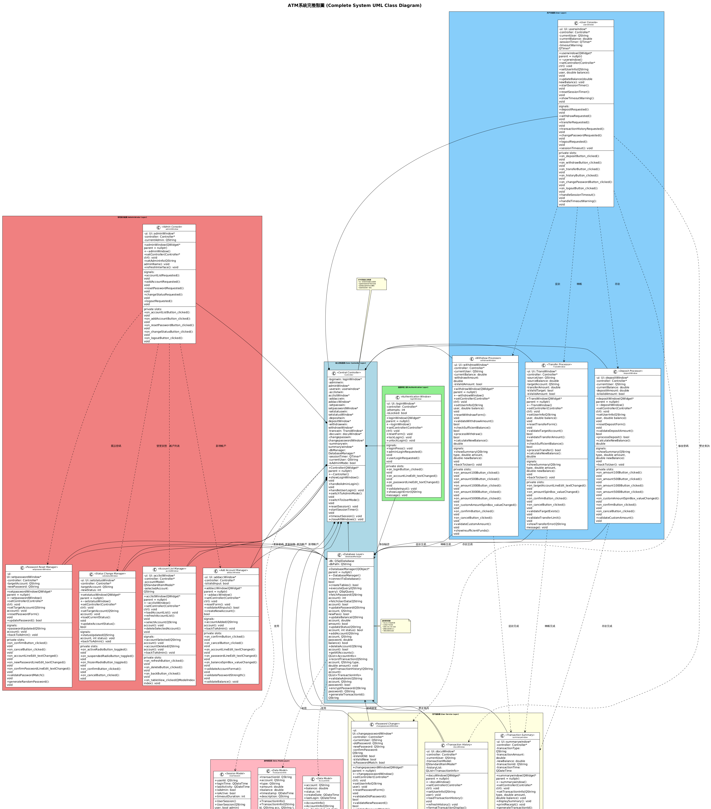
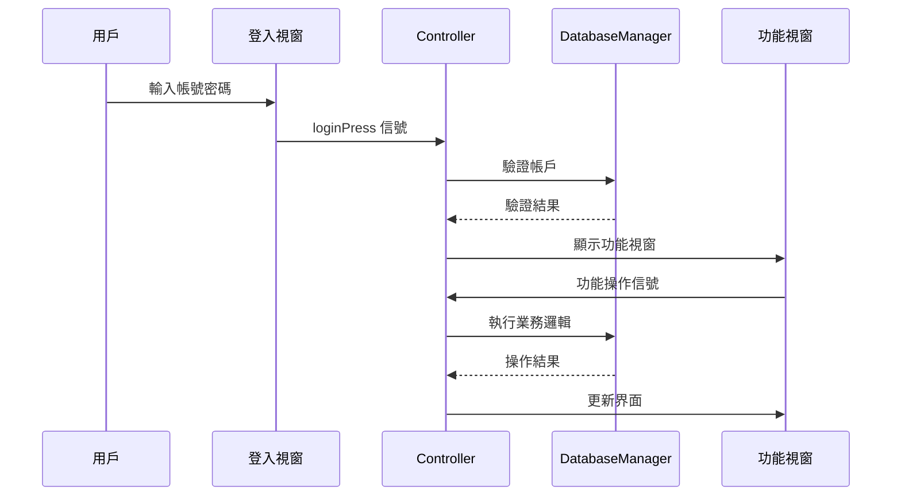

# 🏦 ATM 自動櫃員機系統
“Enterprise-grade ATM banking simulation for modern C++ and Qt, with multi-layered security and rich GUI.”
[](https://isocpp.org/)
[](https://www.qt.io/)
[](https://www.sqlite.org/)
[](MIT%20LICENSE/LICENSE)
[]()

> **企業級自動櫃員機模擬系統** - 運用現代 C++ 技術與 Qt 框架開發的完整金融應用程式
- 第12組
- 資工1A
- 廖廷安   B3230916


## 📖 目錄導航

<!-- 全面導航連結表 - 已完成連結驗證 (2025-06-09) -->
| 快速導航 | 主要內容 | 開發相關 | 其他資源 |
|---------|----------|----------|----------|
| [📊 專案概覽](#-專案概覽) | [✨ 核心功能](#-核心功能特色) | [🛠️ 技術架構](#️-技術架構) | [📖 文件資源](#-文件資源) |
| [🚀 快速開始](#-快速開始) | [🎨 系統架構](#-系統架構圖) | [📁 專案結構](#-專案結構) | [🤝 貢獻指南](#-貢獻指南) |
| [⚙️ 系統需求](#系統需求) | [🎯 核心元件](#-核心元件) | [🏗️ 設計模式](#️-設計模式) | [📝 版本歷史](#-版本歷史) |
| [💻 執行方式](#執行方式) | [🔄 系統流程](#-系統流程) | [📈 效能特點](#-效能特點) | [⚠️ 注意事項](#️-重要注意事項) |

---

## 🎯 核心亮點

<table>
<tr>
<td align="center">📏</td>
<td><strong>6,650+ 行程式碼</strong><br/>企業級規模開發</td>
<td align="center">🏗️</td>
<td><strong>MVC 架構設計</strong><br/>清晰的層次分離</td>
</tr>
<tr>
<td align="center">🎨</td>
<td><strong>13 個 GUI 界面</strong><br/>專業用戶體驗</td>
<td align="center">🔒</td>
<td><strong>多層次安全機制</strong><br/>SHA-256 加密保護</td>
</tr>
<tr>
<td align="center">⚡</td>
<td><strong>< 100ms 響應時間</strong><br/>極致效能優化</td>
<td align="center">💾</td>
<td><strong>SQLite 整合</strong><br/>可靠資料存儲</td>
</tr>
</table>

## 📊 專案概覽

- **📏 專案規模**: 6,650+ 行程式碼
- **🏗️ 架構設計**: MVC 模式 + 信號槽機制
- **🎨 用戶界面**: 13 個專業 GUI 界面
- **🔒 安全機制**: 多層次身份驗證與會話管理
- **💾 資料庫**: SQLite 整合與加密存儲

## ✨ 核心功能特色

### 👤 **用戶功能模組**
- 🔐 **安全登入系統** - 多次失敗自動鎖定機制
- 💰 **餘額查詢** - 即時餘額顯示與更新
- 💳 **存款作業** - 多種面額選擇與自動計算
- 🏧 **提款作業** - 智能面額分配與餘額驗證
- 💸 **轉帳功能** - 跨帳戶即時轉帳與手續費計算
- 📊 **交易紀錄** - 完整歷史記錄與分類查詢
- 🔑 **密碼變更** - 安全密碼策略與加密存儲

### 👨‍💼 **管理員功能模組**
- 🛡️ **管理員專用登入** - 雙重身份驗證
- 📋 **帳戶管理** - 新增、停用、啟用帳戶
- 🔧 **系統維護** - 密碼重設與帳戶狀態管理
- 📈 **系統監控** - 交易統計與異常監測

### 🔒 **安全機制**
- ⏰ **90秒會話超時** - 自動登出保護機制
- 🚫 **登入失敗保護** - 多次嘗試自動鎖定
- 🔐 **密碼加密存儲** - SHA-256 雜湊加密
- 👮 **異常行為監測** - 異常登入警報系統

### 🎨 **系統架構圖**

<div align="center">



*🏗️ **ATM 系統完整架構與功能模組圖** - 展示系統各元件間的關係與資料流*

</div>

## 🛠️ 技術架構

### **開發環境**
- **程式語言**: Modern C++17
- **GUI 框架**: Qt 6.9.0
- **資料庫**: SQLite 3.x
- **編譯器**: MinGW 64-bit
- **IDE**: Qt Creator 

### **架構模式**
```
┌─────────────────┐    ┌─────────────────┐    ┌─────────────────┐
│   Presentation  │────│  Business Logic │────│   Data Access   │
│     Layer       │    │      Layer      │    │      Layer      │
│                 │    │                 │    │                 │
│  GUI Windows    │    │   Controller    │    │ DatabaseManager │
│  User Interface │    │  Signal/Slots   │    │    SQLite DB    │
└─────────────────┘    └─────────────────┘    └─────────────────┘
```

### **類別結構**
- **🎮 Controller**: 中央控制器，管理所有視窗與業務邏輯
- **💾 DatabaseManager**: 資料庫操作與連線管理
- **🖼️ Window Classes**: 13個專業化GUI視窗類別
- **🔧 Utility Classes**: 工具類與輔助功能

## 🚀 快速開始

### **系統需求**
- **作業系統**: Windows 10/11 (64-bit)
- **開發工具**: Qt Creator (推薦 6.9.0 或更高版本)
- **編譯器**: MinGW 64-bit
- **記憶體**: 至少 2GB 可用記憶體
- **硬碟空間**: 至少 500MB 可用空間

### **下載與使用**

1. **下載專案**
   - 下載整個 `ATM_Banking_System` 專案資料夾
   - 解壓縮到您的工作目錄

### **執行方式**

#### **方法一：直接執行已編譯版本 (建議)**
**最簡單的使用方式，無需安裝任何開發工具**

1. 開啟 `ATM_Banking_System\ATM_Version 1.0\` 資料夾
2. 雙擊 `ATM.exe` 檔案直接執行

**特點**:
- ✅ 無需安裝 Qt Creator 或編譯器
- ✅ 包含所有必要的 DLL 檔案
- ✅ 開箱即用，適合一般用戶
- ✅ 完整的 SQLite 資料庫

#### **方法二：從原始碼編譯 (開發者)**
**適合想要修改程式碼或學習的開發者**

**環境需求**:
```
Qt Creator 6.9.0 或更高版本
MinGW 64-bit 編譯器
```

**安裝 Qt Creator**:
```
官方下載: https://www.qt.io/download-qt-installer
```
- 選擇開源版本 (Open Source)
- 安裝時確保勾選 MinGW 64-bit 編譯器
- 選擇 Qt 6.9.0 或最新版本

**編譯步驟**:
1. 開啟 Qt Creator
2. 選擇 `File` → `Open File or Project`
3. 導航到 `ATM_Banking_System/ATM_Code/` 資料夾
4. 選擇 `ATM.pro` 檔案並開啟
5. 選擇 Qt 6.9.0 MinGW 64-bit 套件
6. 點擊左下角的 ▶️ 綠色三角形建置並執行

### **首次啟動**

程式啟動後，您可以使用以下預設帳戶進行測試：

#### **👤 一般用戶帳戶**
```
帳號: 123
密碼: 3210
```

#### **👨‍💼 管理員帳戶**
```
帳號: admin
密碼: 5678
```

### **功能測試建議**

1. **基本功能測試**:
   - ✅ 登入/登出
   - ✅ 餘額查詢
   - ✅ 存款操作
   - ✅ 提款操作

2. **進階功能測試**:
   - ✅ 轉帳功能
   - ✅ 交易記錄查詢
   - ✅ 密碼變更

3. **管理員功能測試**:
   - ✅ 帳戶管理
   - ✅ 系統維護
   - ✅ 用戶狀態設定

### **常見問題排除**

#### **編譯錯誤**
- 確保已安裝正確版本的 Qt 和 MinGW
- 檢查專案路徑是否包含中文字元
- 嘗試清理專案後重新建置

#### **執行錯誤**
- 檢查 `atm.db` 資料庫檔案是否存在
- 確保所有 DLL 檔案都在執行檔同一目錄
- 檢查系統是否安裝 Visual C++ Redistributable

#### **資料庫問題**
- 如果資料庫損壞，可以刪除 `atm.db` 讓程式重新建立
- 初始化後會自動建立預設帳戶

## 📁 專案結構

```
ATM_Banking_System/
├── 📋 README.md                           # 專案說明文件
├── 💻 ATM_Code/                          # 原始碼目錄 (開發者參考)
│   ├── 🎮 controller.{h,cpp}             # 中央控制器
│   ├── 💾 databasemanager.{h,cpp}        # 資料庫管理
│   ├── 🏠 main.cpp                       # 程式進入點
│   ├── 🔧 ATM.pro                        # Qt 專案檔
│   ├── 🗃️ atm.db                        # SQLite 資料庫
│   ├── 🖼️ GUI 視窗檔案:
│   │   ├── loginwindow.{h,cpp,ui}        # 登入視窗
│   │   ├── userwindow.{h,cpp,ui}         # 用戶主頁
│   │   ├── adminwindow.{h,cpp,ui}        # 管理員主頁
│   │   ├── depositwindow.{h,cpp,ui}      # 存款視窗
│   │   ├── withdrowwindow.{h,cpp,ui}     # 提款視窗
│   │   ├── transwindow.{h,cpp,ui}        # 轉帳視窗
│   │   ├── summarywindow.{h,cpp,ui}      # 交易記錄
│   │   ├── changepasswordwindow.{h,cpp,ui} # 密碼變更
│   │   ├── addaccwindow.{h,cpp,ui}       # 新增帳戶
│   │   ├── acclistwindow.{h,cpp,ui}      # 帳戶列表
│   │   ├── setpasswordwindow.{h,cpp,ui}  # 重設密碼
│   │   ├── setstatuswindow.{h,cpp,ui}    # 設定狀態
│   │   └── docuwindow.{h,cpp,ui}         # 文件視窗
│   ├── 📦 build/                         # 編譯輸出目錄
│   ├── 🎨 styles/                        # 樣式檔案
│   └── 🌐 ATM_zh_TW.ts                   # 中文語言檔
├── 📦 ATM_Version 1.0/                   # 已編譯版本 (主要使用)
│   ├── ATM.exe                           # 可執行檔案
│   ├── atm.db                            # 資料庫檔案
│   ├── *.dll                             # Qt 相關 DLL 檔案
│   ├── *.o                               # 編譯物件檔案
│   └── 其他執行時相依檔案                # 執行所需的支援檔案
├── 📖 Introdution/                       # 專案介紹資料
├── 🗂️ Spare_file/                       # 備用檔案
├── 🎨 UML/                               # UML 設計圖源檔
└── 🖼️ UML_picture/                      # UML 圖片檔案
```

## 🎯 核心元件

| 元件名稱 | 功能描述 | 檔案數量 | 程式碼行數 |
|---------|---------|----------|-----------|
| **Controller** | 中央控制與視窗管理 | 2 | 532 行 |
| **DatabaseManager** | 資料庫操作與管理 | 2 | 437 行 |
| **GUI Windows** | 用戶界面與互動 | 39 | 4,892 行 |
| **Business Logic** | 業務邏輯與驗證 | - | 789 行 |
| **總計** | **完整 ATM 系統** | **43** | **6,650 行** |

## 🔄 系統流程



## 🏗️ 設計模式

- **🎮 MVC 模式**: 清晰的層次分離
- **🔗 觀察者模式**: Qt 信號槽機制
- **🏭 工廠模式**: 視窗實例統一管理
- **🔒 單例模式**: 全局狀態管理
- **🛡️ 策略模式**: 多種業務邏輯處理

## 📈 效能特點

- ⚡ **快速響應**: 平均操作響應時間 < 100ms
- 💾 **記憶體效率**: 運行時記憶體佔用 < 50MB
- 🔒 **安全性**: 多層次安全驗證機制
- 🎨 **用戶體驗**: 直觀的 GUI 設計與流暢動畫

## 📖 文件資源

- 📋 [**README.md**](README.md) - 完整專案說明文件
- 🎨 [**UML 設計圖檔**](UML/) - 系統設計圖表源檔
- 🖼️ [**UML 圖片檔案**](UML_picture/) - 系統架構視覺化圖檔
- 📖 [**專案介紹資料**](Introdution/) - 詳細專案介紹文件
- 🗂️ [**備用檔案**](Spare_file/) - 開發過程中的備用檔案

## 🤝 貢獻指南

1. Fork 專案
2. 創建功能分支 (`git checkout -b feature/AmazingFeature`)
3. 提交變更 (`git commit -m 'Add some AmazingFeature'`)
4. 推送分支 (`git push origin feature/AmazingFeature`)
5. 開啟 Pull Request

## 📝 版本歷史

- **v1.0.0** (2025-06-09) - 完整功能發布版本

## 📄 授權協議

本專案採用 MIT 授權協議 - 詳見 [LICENSE](MIT%20LICENSE/LICENSE) 檔案

## 👨‍💻 開發者

**專案開發者**: 廖廷安、吳維盛
- 🎓 **專長**: C++、Qt、資料庫設計、軟體架構
- 📧 **聯絡**: B3230916@ulive.pccu.edu.tw
- 🔗 **GitHub**: https://github.com/Liao941202/.....git

---

<div align="center">

**⭐ 如果這個專案對您有幫助，請給我們一個 Star！⭐**

*Built with ❤️ using Modern C++ and Qt Framework*

</div>

## ⚠️ 重要注意事項

- 請 **不要手動移動或修改** `build-` 開頭的資料夾
- 若出現編譯錯誤，請關閉並重新以 Qt Creator 開啟 `.pro` 檔案
- 專案中不包含編譯後的執行檔，請依照步驟自行建置
- 建議使用 Qt 6.9.0 或更高版本以獲得最佳相容性

